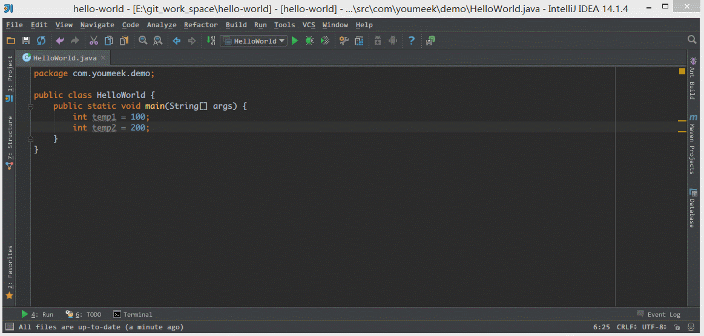
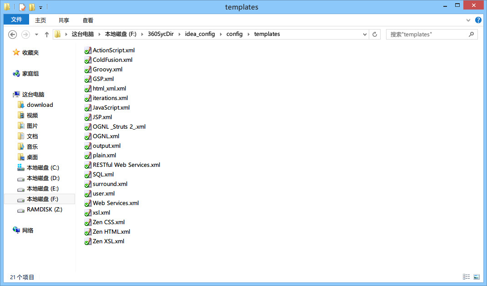
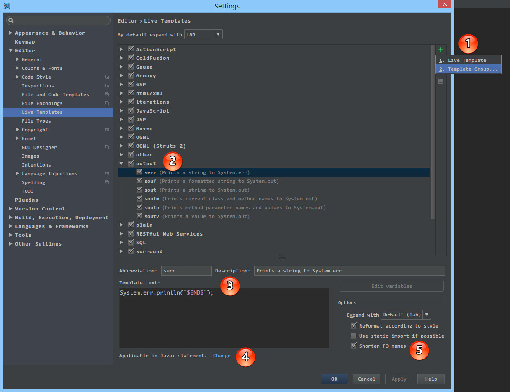
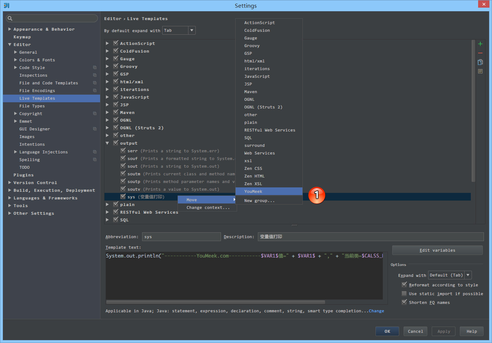
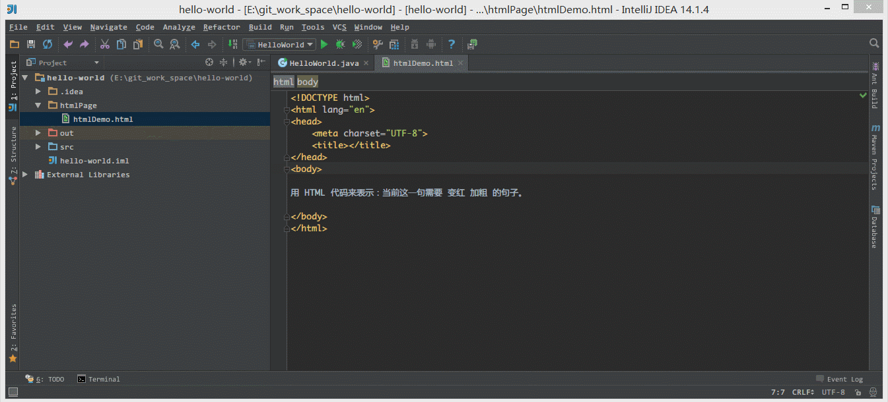

# 实时代码模板的使用

## 实时代码模板的介绍

> * 上图 Gif 演示为最好的介绍 `Live Templates`。
> * 实时代码模板需要字符串前缀，如 Gif 演示中，在输入 `sys` 后生成一段输出语句，其中 `sys` 前缀是我自己设置的。
> * 实时代码模板支持变量参数设置，如 Gif 演示中，在输入 `temp1` 的时候，后面自动也生成了一个 `temp1`，这是因为两者的变量名是一致的，所以我设置了一个变量值内容之后，相同变量值的内容也会跟着出现。
> * 实时代码模板支持最后位置的定位，如 Gif 演示中，在输入完 `temp1` 之后，按 `Enter` 后自动跳转到语句末。虽然默认没有设置的时候也是在这个位置，但是我是通过设置来定位到此位置的。
> * 实时代码模板支持获取当前类名和当前方法名（本质是内置函数），如 Gif 演示中，在输入完 `sys` 生成输出语句中自动带有当前类名和方法名。
> * 综上效果：实时代码模板只是为了让我们更加高效的写一些固定模式的代码，以提高编码效率，同时也可以增加个性化。比如 Gif 演示中，我在开发中如果需要写输出的话，我个人习惯输出语句中前缀是自己的标记：横线和域名，以区分其他人输出，方便做全文搜索。
> * 官网介绍 `Live Templates`：<https://www.jetbrains.com/idea/help/live-templates.html>

> * 如上图标注所示，实时代码模板本质是用 XML 文件来保存的，所以传播自己的实时代码模板只要传播对应的文件即可。
> * IntelliJ IDEA 的实时代码模板保存在 `/templates` 目录下，其他系统目录位置如下：（因为目录名在各个系统上是一致的，建议用硬盘搜索工具搜索即可）
>
>> * Windows: <your home directory>\.<product name><version number>\config\templates
>> * Linux: ~/.<product name><version number>/config/templates
>> * OS X: ~/Library/Preferences/<product name><version number>/templates 

调用常规的实时代码模板主要是通过两个快捷键：`Tab` 和 `Ctrl + J`。虽然 IntelliJ IDEA 支持修改此对应的快捷键，但是默认大家都是这样使用的，所以没有特别愿意就不要去改。
 
该两个快捷键的使用方法：如第一张 Gif 演示图所示，在输入 `sys` 后按 `Tab` 键，即立即生成预设语句。如果按 `Ctrl + J` 则会先提示与之匹配的实时代码模板介绍，然后还需按 `Enter` 才可完成预设语句的生成。

## 自带变量参数介绍

在文章开头我们已经有提到 IntelliJ IDEA 实时代码模板是有变量参数设置的，其中 IntelliJ IDEA 自带了两个变量参数：

> * `$END$`，表示最后都编辑完后光标所处的位置
> * `$SELECTION$`，表示设置环绕实时代码模板，环绕功能下面会模板专门进行介绍。
> * 除了上面两个变量参数外，其他一律都会自定义变量。
> * 官网介绍：<https://www.jetbrains.com/idea/help/live-template-variables.html>
>
>> * `$END$` indicates the position of the cursor after the template is expanded.
>> * `$SELECTION$` is used in surround templates and stands for the code fragment to be wrapped.

## 实时代码模板的设置

> * 如上图标注 1 所示，除了 IntelliJ IDEA 预设的模板之外，我们还可以创建新组和新实时代码模板，其中组是用来包含实时代码模板的。
> * 如上图标注 2 所示，`output` 是组名，告诉开发者，这组里面实时代码模板都是用来做输出的。`serr` 表示实时代码模板输出 `System.err` 的简称，所以这个不是一个完整的单词，不需要读懂，只需要记忆。
> * 如上图标注 3 所示，实时代码模板的内容，其中用到了预设的变量 `$END$`。 
> * 如上图标注 4 所示，可设置该实时代码模板的试用范围，比如图上的 `serr` 这是 Java 代码，所以试用范围我们就应该只是 Java 文件上或是 JSP 这类文件上，设置在 HTML 或是 CSS 文件上就完全没有多大意义了。
> * 如上图标注 5 所示，勾选了辅助的功能：
>
>> * `Reformat according to style` 对生成的代码进行格式化。
>> * `Shorten FQ names` 关于此设置的说明我没有找到，所以暂时无法给个很少的解释，只是看到材料说明一般需要勾上此设置，如果您有好的答案，还请联系我。 

> * 如上图标注 1 所示，我们可以对实时代码模板进行组的转移。

## 变量参数和函数的介绍

如文章开头演示的 Gif 实时代码模板，其实时代码模板内容为：`System.out.println("-----------YouMeek.com-----------$VAR1$值=" + $VAR1$ + "," + "当前类=$CLASS_NAME$.$METHOD_NAME$()");$END$`

> * `$VAR1$`、`$CLASS_NAME$`、`$METHOD_NAME$` 都为自己定义的变量名。设置变量名只要用两个 `$` 包住即可。
> * 每个变量在代码输出的时候都是一次光标位置，光标跳动顺序从左到右，每次跳动按 `Enter`。

> * 如上图标注红圈所示，可以对编辑代码内容的变量。
> * 如上图标注 1 所示，演示中变量名 `$CLASS_NAME$`、`$METHOD_NAME$` 会自动输出当前类名和方法名是因为使用对应的函数 `className()` 和 `methodName()`。
> * 如上图标注 2 所示，如上面介绍的，每个变量都是一次光标位置，但是演示中变量名 `$CLASS_NAME$`、`$METHOD_NAME$` 没有进入，是因为勾选了 `Ship if defined`。 
> * 如上图标注 3 所示，可以改变变量光标跳转时的顺序。
> * 内置函数介绍：<https://www.jetbrains.com/idea/help/live-template-variables.html>
>
>> * 对于官网这些函数这里就不在累赘，官网有详细的介绍，如果你还看不懂，可以看 IntelliJ IDEA 已经预设各个实时代码模板，基本上常用的函数都有被引用过，你可以通过学习这些预设的实时代码模板来揣测其函数的用法。

## 环绕功能介绍

> * 上图 Gif 演示为最好的介绍 `surround templates`。
> * 如上图 Gif 演示，环绕模板的前提是：选中要被环绕的内容。
> * 在设置实时代码模板的时候，如果含有预设的变量 `$SELECTION$` 则该实时代码模板是环绕模板。
> * 该功能对于前端开发者来讲是非常方便的，默认 IntelliJ IDEA 已经自带了 HTML 标签的环绕功能。
